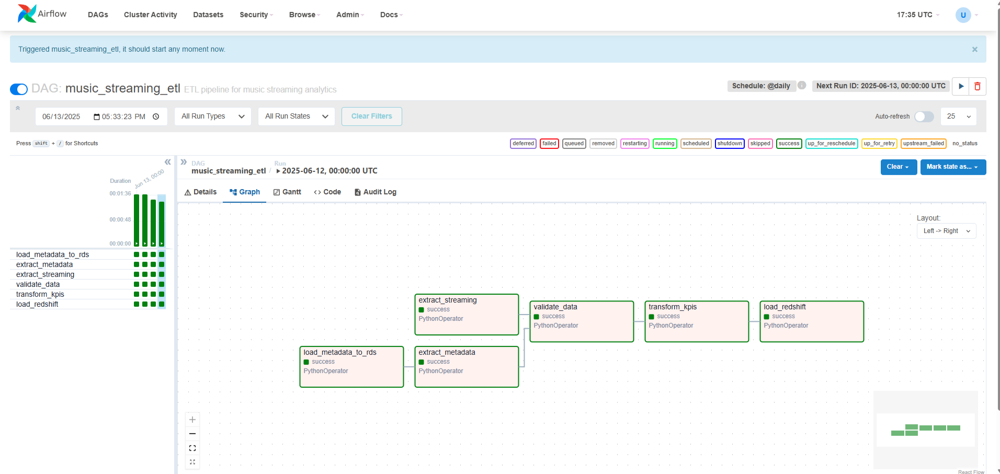

# Music Streaming ETL Pipeline

This project implements an end-to-end ETL (Extract, Transform, Load) pipeline for a music streaming service using Amazon Managed Workflows for Apache Airflow (MWAA). The pipeline ingests user and song metadata from Amazon RDS (simulated via CSV files in S3), processes streaming data from S3, validates and transforms the data, computes key performance indicators (KPIs), and loads the results into Amazon Redshift for analytical querying.

## Table of Contents

- [Music Streaming ETL Pipeline](#music-streaming-etl-pipeline)
  - [Table of Contents](#table-of-contents)
  - [Overview](#overview)
  - [Architecture](#architecture)
  - [Prerequisites](#prerequisites)
  - [Setup Instructions](#setup-instructions)
  - [Pipeline Details](#pipeline-details)
- [add image](#add-image)
  - [Validation Queries](#validation-queries)
  - [Troubleshooting](#troubleshooting)
  - [Cost Considerations](#cost-considerations)
  - [Future Improvements](#future-improvements)

## Overview

The pipeline fulfills the following objectives:

- Ingests user and song metadata from RDS (simulated via S3 CSVs) and streaming data from S3.
- Validates data integrity by checking required columns and cleaning duplicates.
- Computes KPIs:
  - **Genre-Level KPIs**: Listen count, average track duration, popularity index, most popular track per genre.
  - **Hourly KPIs**: Unique listeners, total plays, unique tracks, top artist, track diversity index.
- Loads processed data into Redshift using an optimized MERGE (upsert) strategy.
- Provides detailed logging and error handling for robust operation.

The pipeline is orchestrated by an Airflow DAG (`music_streaming_etl.py`) running in MWAA, with tasks defined in `etl_functions.py`.

## Architecture

- **Data Sources**:
  - User and song metadata: S3 (`users.csv`, `songs.csv`), loaded to RDS.
  - Streaming data: S3 (`streams/*.csv`).
- **Storage**:
  - **Amazon RDS**: Stores `users` and `songs` tables.
  - **Amazon Redshift Serverless**: Stores `users`, `songs`, `streams`, `genre_kpis`, and `hourly_kpis` tables for analytics.
  - **Amazon S3**: Staging area for validated data and KPIs.
  - **Amazon DynamoDB**: Tracks processed streaming files (`ProcessedFiles` table).
- **Orchestration**: MWAA (Airflow 2.9.2) runs the DAG daily.
- **Compute**: Python tasks in MWAA workers handle extraction, validation, transformation, and loading.

## Prerequisites

- AWS account with permissions to manage MWAA, S3, RDS, Redshift Serverless, DynamoDB, IAM, Secrets Manager, and CloudWatch.
- MWAA environment (Airflow 2.9.2).
- S3 bucket.
- RDS PostgreSQL instance with `users` and `songs` tables.
- Redshift Serverless workgroup.
- DynamoDB table: `ProcessedFiles` with partition key `file_key` (string).
- Test data in S3: `data/users/users.csv`, `data/songs/songs.csv`, `data/streams/*.csv`.

## Setup Instructions

1. **Configure S3**:

   - Upload scripts:
     ```bash
     aws s3 cp music_streaming_etl.py s3://amalitechde-music-streaming-lab/dags/
     aws s3 cp etl_functions.py s3://amalitechde-music-streaming-lab/dags/scripts/
     ```
   - Upload `requirements.txt`:

     ```bash
     aws s3 cp requirements.txt s3://amalitechde-music-streaming-lab/
     ```

     Content (requirements.txt):

     ```text
        --constraint https://raw.githubusercontent.com/apache/airflow/constraints-2.9.2/constraints-3.11.txt

        pandas
        apache-airflow-providers-amazon
     ```

2. **Set Up MWAA**:

   - Create an MWAA environment (e.g., `music-streaming-mwaa`) with:
     - Airflow version: 2.9.2.
     - Environment class: `mw1.small`.
     - DAGs S3 path: `s3://amalitechde-music-streaming-lab/dags/`.
     - Requirements S3 path: `s3://amalitechde-music-streaming-lab/requirements.txt`.
     - Execution role: `arn:aws:iam::198170203035:role/AirflowMusicStreamingRole`.
   - Update environment after uploading `requirements.txt`:
     ```bash
     aws mwaa update-environment \
       --name music-streaming-mwaa \
       --requirements-s3-path s3://amalitechde-music-streaming-lab/requirements.txt \
       --region us-east-1
     ```

3. **Configure IAM Role**:

   - Attach policy to a `AirflowMusicStreamingRole` (with policy: `AirflowMusicStreamingLab1Policy.json`), ensuring permissions for:
     - S3: `GetObject`, `ListBucket`, `PutObject`, `DeleteObject`.
     - RDS: `rds-db:connect`.
     - Redshift: `ExecuteQuery`, `Copy`, `GetClusterCredentials`.
     - DynamoDB: `GetItem`, `PutItem`.
     - CloudWatch: `PutLogEvents`.
     - Secrets Manager: `GetSecretValue`.

4. **Set Up Connections in Airflow UI**:

   - Configure Airflow connections in Secrets Manager:
     ```bash
     aws_default: Access ID and Secret Key, region
     rds_postgres: RDS Postgres connection details (Host, database, port, username, password)
     redshift_conn: Redshift connection details
     ```

5. **Upload Test Data**:

   - Place CSVs in S3:
     ```bash
     aws s3 cp users.csv s3://amalitechde-music-streaming-lab/data/users/
     aws s3 cp songs.csv s3://amalitechde-music-streaming-lab/data/songs/
     aws s3 cp stream1.csv s3://amalitechde-music-streaming-lab/data/streams/
     ```

6. **Run the Pipeline**:
   - Access MWAA UI (AWS Console → MWAA → Open Airflow UI).
   - Enable and trigger `music_streaming_etl` DAG.
   - Monitor logs in CloudWatch: `/aws/mwaa/music-streaming-mwaa`.

## Pipeline Details

- **DAG**: `music_streaming_etl` (runs daily).
- **Tasks**:
  1. `load_metadata_to_rds`: Loads `users.csv` and `songs.csv` from S3 to RDS staging tables, then upserts to `users` and `songs`.
  2. `extract_metadata`: Extracts `users` and `songs` from RDS.
  3. `extract_streaming`: Reads new streaming CSVs from S3, tracks processed files in DynamoDB.
  4. `validate_data`: Cleans duplicates, ensures data types, and writes validated CSVs to `/tmp/`.
  5. `transform_kpis`: Computes genre-level and hourly KPIs from Redshift data.
  6. `load_redshift`: Upserts validated data and KPIs to Redshift using staging tables and MERGE.
- **Dependencies**:

  ```
  load_metadata_to_rds → extract_metadata → validate_data
  extract_streaming → validate_data → transform_kpis → load_redshift
  ```

  # add image

  

- **Redshift Schema**:

  - `users`: `user_id (PK)`, `user_name`, `user_age`, `user_country`, `created_at`.
  - `songs`: `id (PK)`, `track_id`, `artists`, `album_name`, `track_name`, etc.
  - `streams`: `user_id`, `track_id`, `listen_time (PK)`.
  - `genre_kpis`: `track_genre (PK)`, `listen_count`, `avg_track_duration_ms`, etc.
  - `hourly_kpis`: `hour (PK)`, `unique_listeners`, `total_plays`, etc.

- **Logging**: Logs are written to CloudWatch with `INFO`, `WARNING`, and `ERROR` levels for each task.

## Validation Queries

Run these SQL queries in Redshift to verify data:

1. **Check Loaded Users**:

   ```sql
   SELECT user_id, user_name, user_age, user_country, created_at
   FROM users
   LIMIT 5;
   ```

2. **Check Loaded Songs**:

   ```sql
   SELECT id, track_id, track_name, artists, track_genre
   FROM songs
   LIMIT 5;
   ```

3. **Check Streaming Data**:

   ```sql
   SELECT user_id, track_id, listen_time
   FROM streams
   ORDER BY listen_time DESC
   LIMIT 5;
   ```

4. **Verify Genre KPIs**:

   ```sql
   SELECT track_genre, listen_count, avg_track_duration_ms, popularity_index, track_name
   FROM genre_kpis
   ORDER BY listen_count DESC
   LIMIT 5;
   ```

5. **Verify Hourly KPIs**:
   ```sql
   SELECT hour, unique_listeners, total_plays, top_artist, track_diversity_index
   FROM hourly_kpis
   ORDER BY total_plays DESC
   LIMIT 5;
   ```

## Troubleshooting

- **DAG Not Visible**:

  - Check S3 paths:
    ```bash
    aws s3 ls s3://amalitechde-music-streaming-lab/dags/
    aws s3 ls s3://amalitechde-music-streaming-lab/dags/scripts/
    ```
  - Verify `requirements.txt`:
    ```bash
    aws s3 ls s3://amalitechde-music-streaming-lab/requirements.txt
    ```
  - Check CloudWatch logs: `/aws/mwaa/music-streaming-mwaa/scheduler`.
  - Trigger environment update:
    ```bash
    aws mwaa update-environment --name music-streaming-mwaa --region us-east-1
    ```

- **ModuleNotFoundError:**:

  - Ensure `requirements.txt` includes required modules.
  - Update MWAA environment and wait 20–30 minutes.

- **Connection Errors**:

  - Verify Airflow Connections: `rds_postgres`, `redshift_conn`, `aws_default`.
  - Check VPC connectivity to RDS (port 5432) and Redshift (port 5439).

- **IAM Issues**:
  - Confirm `AirflowMusicStreamingRole` has required permissions.

## Cost Considerations

- **MWAA**: ~ $350/month (`mw1.small`). Use `mw1.medium` (~$700/month) for larger datasets.
- **S3**: ~ $0.05/month for DAGs, scripts, and data (~2 GB).
- **RDS**: ~ $100/month for `db.t3.micro` PostgreSQL.
- **Redshift Serverless**: ~ $0.36/hour (~$260/month for continuous use). Pause workgroup when idle.
- **DynamoDB**: ~ $0.10/month for 1,000 files (on-demand).
- **CloudWatch**: ~ $0.50/GB for logs. Limit retention to 7 days.
- **Secrets Manager**: ~ $0.80/month for two secrets.

**Trade-Offs**:

- **MWAA vs. Self-Hosted Airflow**: MWAA is managed but costly; self-hosted (~ $100/month EC2) requires maintenance.
- **DynamoDB vs. S3 for Tracking**: DynamoDB (~ $0.10/month) is fast; S3 (~ $0.01/month) is cheaper but slower.
- **Redshift Serverless vs. Cluster**: Serverless scales automatically but costs more; clusters are cheaper for predictable workloads.

## Future Improvements

- **S3 Partitioning**: Store streams as `data/streams/YYYY/MM/DD/` for faster access.
- **Monitoring**: Add Airflow sensors to check S3 file availability.
